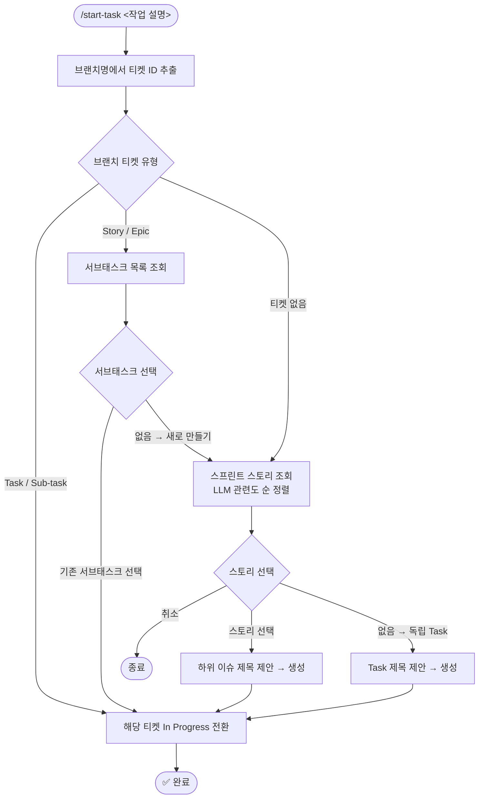
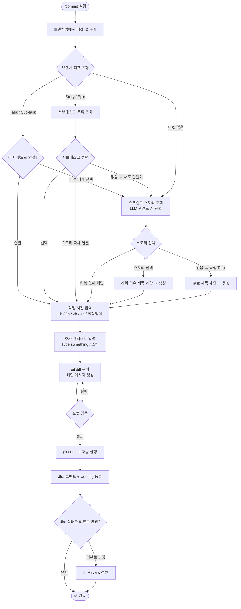

# air-platform-kit

AIR Platform 팀 개발 생산성 스킬 모음입니다.

## 설치

```bash
/plugin marketplace add https://<TOKEN>@github.com/air-platform-aie/air-platform-kit.git
/plugin install air-platform-kit@air-platform-kit
```

> **SAML SSO 토큰 발급**: https://github.com/settings/tokens → "Configure SSO" → "mzcair" → "Authorize"

## 업데이트

```bash
/plugin marketplace update air-platform-kit
/reload-plugins
```

---

## 스킬 목록

### `/air-platform-kit:start-task` — 작업 시작

티켓 없이 코드 작업을 시작할 때 Jira 티켓을 생성하고 In Progress로 전환합니다.

```bash
/air-platform-kit:start-task 로그인 API 인증 로직 수정
```



---

### `/air-platform-kit:commit` — 커밋

변경사항을 분석해 커밋 메시지를 자동 생성하고 Jira에 작업 내용을 기록합니다.

```bash
/air-platform-kit:commit
```



**커밋 메시지 포맷:**
```
feat(api): 로그인 API 인증 로직 수정

JWT 토큰 만료 처리를 개선했습니다.
- 만료된 토큰 자동 갱신 로직 추가
- 인증 실패 시 에러 메시지 개선

Refs: BRAIN-100

Generated-By: Claude Code
```

| Prefix | 용도 |
|--------|------|
| `feat` | 새로운 기능 |
| `fix` | 버그 수정 |
| `refactor` | 리팩토링 |
| `chore` | 설정/의존성 변경 |

---

## 프로젝트 설정

프로젝트 루트에 `.claude/commit-plugin.config.json` 생성:

```bash
mkdir -p .claude
cat > .claude/commit-plugin.config.json << 'EOF'
{
  "jiraProjectKey": "BRAIN"
}
EOF
```

> **보안**: `.claude/commit-plugin.config.json`을 `.gitignore`에 추가하세요.

## 요구사항

- Claude Code MCP Atlassian 연동 설정 필요
- Jira 프로젝트 접근 권한 필요
- MCP 미설치 시 Jira 연동 없이 커밋만 진행 (commit 스킬)
